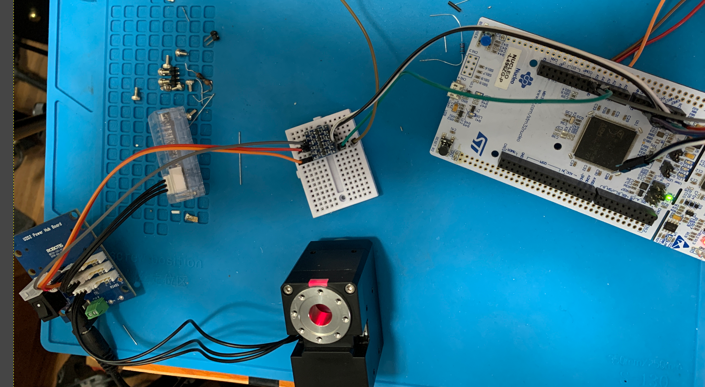
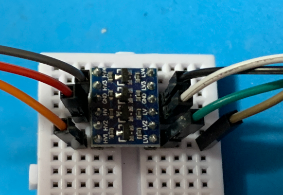
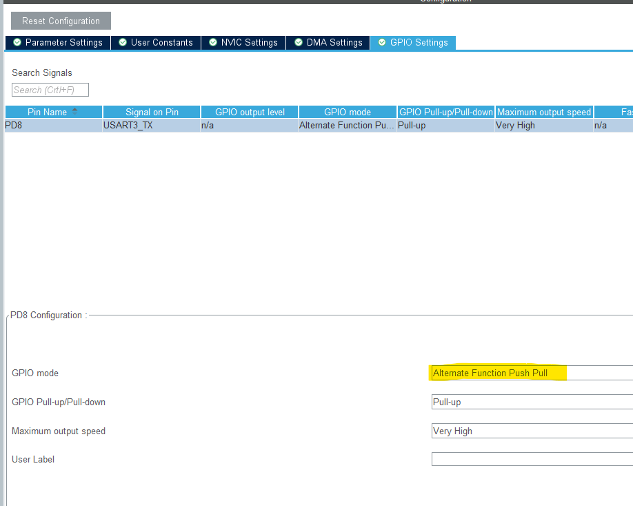
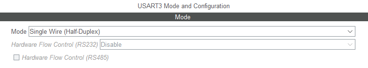
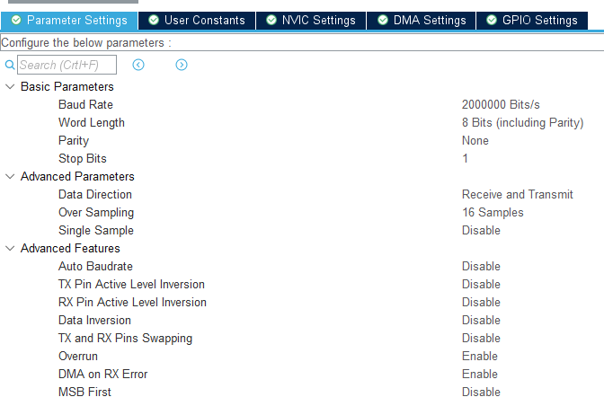
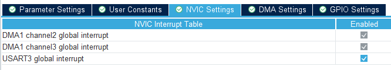
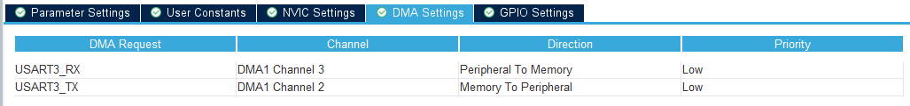

# 22a_Dynamixel TTL with roboCore

## Introduction
Cet exemple montre comment utiliser les moteurs dynamixel XM540.

Un petite trajectoir de 3 points est "hardcodé".  

1. Branché moteur(s) selon les explication de branchement

2. Ouvrir un port série poru communiquer avec les Nucléo à 460800 bps.

3. Enboyer le byte 13 ( appuyer sur enter) poru démarrer la trajectoir

   

## Requis matériel
Dev board NUCLEO L496ZG-P

## Requis logiciels

- Développé avec STM32CubeIDE - Version: 1.8.0
  Build: 11526_20211125_0815 (UTC)
- Configuration du projet fait avec Stm32 Cube MX - Version: 6.4.0-RC4
  Build: 20211122-2105 (UTC)


### Compatibilité

#### Matériel supporté

##### ST boards

- Développé et testé sur le NUCLEO L496ZG-P


## Requis logiciels

- Développé avec STM32CubeIDE - Version: 1.8.0
  Build: 11526_20211125_0815 (UTC)
- Configuration du projet fait avec Stm32 Cube MX - Version: 6.4.0-RC4
  Build: 20211122-2105 (UTC)

### Librairies requises

- at_platformAbstraction_stm32L4
- CircularBuffer_V1_1
- dynamixel_V1_1
- dynamixel_xm
- robocore
- uartManager_V1_0
- teamAtBasic_V1_1


## Démarrage

###  STM32 L4 Nucleo

   1. Brancher board nucleo USB ( en utilisant le connecteur CN1)
   2. Ouvrir le projet avec STM32 Cube IDE
      3. Programmer le code

#### Hardware setup

| Pin      | Connecteur | Nom  | Description  |
| -------- | ---------- | ---- | ------------ |
| 3.3V     | CN8-7      | 3.3V |              |
| GND      | CN8-11     | GND  |              |
| PD8 / D1 | CN10-14    |      | 3V TTL Rx/TX |
|          |            |      |              |
|          |            |      |              |
|          |            |      |              |
|          |            |      |              |
|          |            |      |              |
|          |            |      |              |


In order to interface the Dynamixel motor with the Nucleo board, you will need a @level shifter@ board because the TTL level of the dynamixel is 5V and the pin level of the STM32 is 3.3V.



Note: The TTL port has been change from PC4 ( on the picture above) to PD8.  The picture is to show general connectivity between Dynamixel and stm32 board.





| Level shifter Pin name | Target device | Pin name           | Description     |
| ---------------------- | ------------- | ------------------ | --------------- |
| HV1                    | Dynamixel     | D ( Data)          | 5V TTL data     |
| HV                     | Dynamixel     | V                  | 5V power supply |
| GND                    | Dynamixel     | G                  | Ground          |
| LV1                    | Nucleo board  | CN10-14 (PD8 / D1) |                 |
| LV                     | Nucleo Board  | CN8-7              | 3.3V            |
| GND                    | Nucleo Board  | CN8-11             | Ground          |


##### Pour plus de détails


### Mise en place

#### Étape 1: Configurer le périphérique dans CUBEMX  

##### Configuration du GPIO 

​		**Important:** La pin  de communication TTL doit être configuré en mode push/pull dans cube mx ou dans le code


###### 	Dans cube MX




##### 	Configuration du UART











#### Étape 2: Mise en place dans le main

tout le code lié a l'Exemple se trouve dans dynamixelExempleApp.cpp / .h

uartApp.cpp/h sont aussi requis

1. ##### Initialisation 

   Appeler dans la portion init3mainvar du main.

   ```
   
   		// ! [init3mainvar]
   		// Variables
   		// *** USER
   			dynamixelExample_init();
   
   		// ! [init3mainvar]
   ```

   

2. Pre-loop

   Quelque lignes de code de mise en place avant de démarrer la boucle

   ```
   	// ! [preLoopSetup]
   	dynamixelExample_beforeLoop();
   	// ! [preLoopSetup]
   
   	while (1)
   	{
   	...
   ```

   

3.  La boucle

   Code principal appelé a tous les itération de boucle

   ```
   while (1)
   	{
       /* USER CODE END WHILE */
   
   	/* USER CODE BEGIN 3 */
   
   		dynamixelExample_mainLoop();
   		
   		...
   ```

   

4. Time 10 ms

   Tâches devant être fait aux 10 ms pour cet exemple

```
 if(flagTask10ms)
	  {
		//timingCheck1 = getTimeMicros();	// Get system tick time in us //HAL_GetTick() for ms and 				getTimeMicros() for us;
		flagTask10ms=0;

		/////////////////////////////////////////////////////////////////////
		// *** USER

		dynamixelExample_task10ms();

```


### Détails important spécifique au ...


  

#### Initialisation et démarage ...

#### Utilisation typique ...


